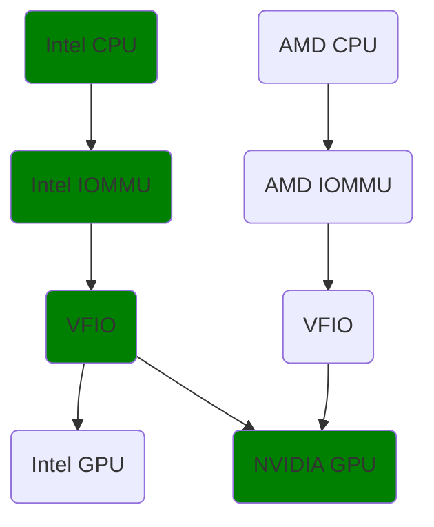

# Proposal B - Compatibility Artifact for nodes validation and community projects

Authors:

- Marcin Franczyk (@mfranczy)
- Joe Huang (@chaoyihuang)

This proposal introduces a new image compatibility artifact type.
The first part of the proposal focuses on the artifact and representation of compatibility with a proposed language.
The second part concerns a tool to be maintained by the OCI organization.
Finally, the last part shows the possible usage scenarios.

## Image Compatibility Artifact

The purpose of the compatibility artifact is to describe CRITICAL requirements for container images to run on a host, if any.
It is NOT TO store variation of user configuration of applications and image compatibility on a node.

### Artifact Manifest

The proposal introduces a new artifact `application/vnd.oci.image-compatibility.v1` and a compatibility spec  `application/vnd.oci.image-compatibility.spec.v1+json` media type.

The compatibility spec must be interpreted by a dedicated software.

```json
{
  "schemaVersion": 2,
  "mediaType": "application/vnd.oci.image.manifest.v1+json",
  "artifactType": "application/vnd.oci.image-compatibility.v1",
  "config": {
    "mediaType": "application/vnd.oci.empty.v1+json",
    "digest": "sha256:44136fa355b3678a1146ad16f7e8649e94fb4fc21fe77e8310c060f61caaff8a",
    "size": 2
  },
  "layers": [
    {
      "mediaType": "application/vnd.oci.image-compatibility.spec.v1+json",
      "digest": "sha256:4a47f8ae4c713906618413cb9795824d09eeadf948729e213a1ba11a1e31d052",
      "size": 1710
    }
  ],
  "annotations": {
    "oci.opencontainers.image.created": "2024-01-02T03:04:05Z"
  }
}
```

### Relation of the Artifact to Image Manifest

```text
 Image Index                                                 
 +----------------------------------------------------------+
 |                                                          |
 |  Image Manifest A             Image Manifest B           |
 |  +-----------------------+    +-----------------------+  |
 |  |platform:              |    |platform:              |  |
 |  |  archictecture: amd64 |    |  archictecture: arm   |  |
 |  |  os: linux            |    |  os: linux            |  |
 |  |                       |    |                       |  |
 |  |digest: abc123         |    |digest: def456         |  |
 |  +--------------------|--+    +--------------------|--+  |
 |                       |                            |     |
 +-----------------------|----------------------------|-----+
                         |                            |      
                         |                            |      
    Artifact A           |       Artifact B           |      
    +--------------------|--+    +--------------------|--+   
    |                    |  |    |                    |  |   
    | Subject Descriptor |  |    | Subject Descriptor |  |   
    | +------------------|-+|    | +------------------|-+|   
    | | digest: abc123     ||    | | digest: def456     ||   
    | +--------------------+|    | +--------------------+|   
    |                       |    |                       |   
    +-----------------------+    +-----------------------+   
```

The design imposes a strong 1 to 1 relationship between the compatibility artifact and the image.
That allows users to independently release artifacts and attach compatibility to the already existing images.

The disadvantage of this solution is that you cannot create compatibility that points to multiple images having the same requirements.

### Artifact Discovery

The referrers API should be used to discover artifacts.

The client will push an associated artifact to an image using the subject/referrers response.
The client will query for an artifact using the referrers response, selecting the entry with a matching artifactType and the most recent "created" timestamp.

### Compatibility Spec

The compatibility spec (`application/vnd.oci.image-compatibility.spec.v1+json`) must represent compatibility requirements and their OPTIONAL relations to each other, nothing more.
The OPTIONAL relations may vary depending on specific conditions such as hardware, operating system etc., and are represented by DAG(s).

The specification rules:

- It SHOULD NOT put any context into the data structure other than mentioned above.
- Different contexts appliance (other than set by the OCI group) SHOULD be done by community tools that solve their specific use cases (for example schedulers, tools to provision nodes etc.).
- If required, specification SHOULD be transformed by the community tools in their own sandbox.

Additionally, the official OCI tool with MINIMAL scope (that also can be exposed over libraries) SHOULD be developed by the OCI Image Compatibility maintainers.
For more details, check [OCI Compatibility Tool](#oci-compatibility-tool) section.

#### Simple Requirements

The specification MUST allow to describe compatibility requirements in a simple form.
For instance, a container supporting only NVIDIA GPUs.

#### Complex Requirements With Relations

The speciifcation MUST allow to describe complex requirements with defined relations to each other.
This is an OPTIONAL functionality for the end-users.
The complex requirements SHOULD be represented by DAG(s).

The following example demonstrate the use case:

- Container requirements to run VM with GPU passthrough - validated on the host with Intel CPU and NVIDIA GPU



#### Spec Proposal

The idea has been inspired by the proposal D.
A new functionality to represent compatibility by DAG(s) has been added.

Schema:

- **`spec`** *string-object map*

  This REQUIRED property describes the compatibility specification.

  - **`compatibilities`** *array of objects*

    This REQUIRED property is a list of compatibility domains.

    - **`id`** *string*

      This REQUIRED property represents the compatibility identifier.

    - **`domain`** *string*

      This REQUIRED property represents the compatibility domain. Domains are used to identify origin of interest groups and their functionality. The name must be a valid domain name.

    - **`attributes`** *object*

      This REQUIRED property specifies the domain attributes that are used for host validations. For instance `kernel.version`, `os.version` etc.
      Domain attributes should be checked on the domain documentation page.

    - **`annotations`** *string-string map*

      This OPTIONAL property describes user defined annotations.

  - **`relations`** *object*

    This OPTIONAL property specifies relations between compatibilities.

    - **`graphs`** - *string-object map*

      This OPTIONAL property specify the compatibility graphs.

      - **`<graphName>`** *object*

        This REQUIRED property specifies the name of the graph, which is later referenced by the `spec.validationCriteria.graphs` field.

        - **`annotations`** *string-string map*

        This OPTIONAL property describes user defined annotations.

        - **`edges`** *array of objects*

          This REQUIRED property describes relation between compatibility nodes.

          - **`from`** *string*

            This REQUIRED property references a source compatibility defined in the `spec.compatibilities` field.
            The compatibility MUST be referenced by `id`.

          - **`to`** *object*

            This REQUIRED property references a target compatibility defined in the `spec.compatibilities.id` field.

            - **`compatibilities`** *array of strings*

              This REQUIRED property references compatibility ids from `spec.compatibilities.<n>.id`.

            - **`condition`** *string*

              This REQUIRED property specify the compatibility validation rule.
              Allowed values: _allOf_ - all referenced compatibilities must pass; _oneOf_ - one referenced compatibility must pass from the list, _noneOf_ - none referenced compatibility can pass.

      - **`validationCriteria`** *array of objects*

        This REQUIRED property defines compatibility criteria.

        - **`graphs`** *array of strings*

          This REQUIRED property references graphs names from `spec.relations.graphs`. The graphs are used to validate the compatibility.

        - **`condition`** *string*

          This REQUIRED property specify the compatibility validation rule.
          Allowed values: _allOf_ - all referenced graphs must pass; _oneOf_ - one referenced graph must pass from the list.

        - **`annotations`** *string-string map*

          This OPTIONAL property describes user defined annotations.

Example of use:

- Simple requirements - container supporting only NVIDIA GPUs

```json
{
  "spec": {
    "compatibilities": [
      {
        "id": "nvidiaGPU",
        "domain": "org.opencontainers",
        "attributes": {
          "hardware.pci.class-id": "0380",
          "hardware.pci.vendor-id": "10de",
          "kernel.configuration.CONFIG_HOTPLUG_PCI_PCIE": "y",
          "kernel.configuration.CONFIG_MODULES": "y",
          "kernel.configuration.CONFIG_MODULE_UNLOAD": "y",
          "kernel.configuration.CONFIG_PCI_MMCONFIG": "y",
          "kernel.configuration.CONFIG_DRM_NOUVEAU": "n"
        }
      }
    ]
  }
}
```

- Complex requirements with relations - container supporting multiple GPUs

```json
{
  "spec": {
    "compatibilities": [
      {
        "id": "intelCpu",
        "domain": "org.opencontainers",
        "attributes": {
          "hardware.cpu.vendor": "GenuineIntel",
          "hardware.cpu.virtualization": "VT-x",
          "kernel.cmdline.intel_iommu": "on"
        }
      },
      {
        "id": "amdCpu",
        "domain": "org.opencontainers",
        "attributes": {
          "hardware.cpu.vendor": "AuthenticAMD",
          "hardware.cpu.virtualization": "AMD-V",
          "kernel.cmdline.amd_iommu": "pt"
        }
      },
      {
        "id": "vfio",
        "domain": "org.opencontainers",
        "attributes": {
          "kernel.modules.vfio": "true",
          "kernel.modules.vfio_iommu_type": "true",
          "kernel.modules.vfio_pci": "true"
        }
      },
      {
        "id": "intelGpu",
        "domain": "org.opencontainers",
        "attributes": {
          "hardware.pci.class-id": "0380",
          "hardware.pci.vendor-id": "8086",
          "kernel.configuration.CONFIG_DRM": "y",
          "kernel.configuration.CONFIG_DRM_I915": "y",
          "kernel.configuration.CONFIG_DRM_I915_USERPTR": "y",
          "kernel.configuration.CONFIG_DRM_I915_GVT": "y",
          "kernel.configuration.CONFIG_DRM_I915_GVT_KVMGT": "y",
        }
      },
       {
        "id": "nvidiaGPU",
        "domain": "org.opencontainers",
        "attributes": {
          "hardware.pci.class-id": "0380",
          "hardware.pci.vendor-id": "10de",
          "kernel.configuration.CONFIG_HOTPLUG_PCI_PCIE": "y",
          "kernel.configuration.CONFIG_MODULES": "y",
          "kernel.configuration.CONFIG_MODULE_UNLOAD": "y",
          "kernel.configuration.CONFIG_PCI_MMCONFIG": "y",
          "kernel.configuration.CONFIG_DRM_NOUVEAU": "n"
        }
      }
    ],
    "relations": {
      "graphs": {
        "intel": {
          "edges": [
            {
              "from": "intelCpu",
              "to": {
                "compatibilties": ["vfio"],
                "condition": "allOf"
              }
            },
            {
              "from": "vfio",
              "to": {
                "compatibilities": ["intelGpu", "nvidiaGpu"],
                "condition": "oneOf"
              }
            }
          ]
        },
        "amd": {
          "annotations": {
            "documenation.url": "https://example.com"
          },
          "edges": [
            {
              "from": "amdCpu",
              "to": {
                "compatibilities": ["vfio", "nvidiaGpu"],
                "condition": "allOf"
              }
            }
          ]
        }
      },
      "validationCriteria": [
        {
          "graphs": ["intel", "amd"],
          "condition": "allOf"
        }
      ]
    }
  }
}
```

## OCI Compatibility Tool

The compatibility tool maintained by OCI should be very minimal in scope
and it should export pkgs for external tools so they can cover their own use cases.

The suggested scope of functionality should be as follows:

- Create artifact.
- Pull and push artifact.
- Validate compatibility specification.
- Validate host.
- Output the compatibility spec in a readable form.

### Implementation

The tool should be written in Golang and implement in-tree plugins architecture.

The structure should be similar to:

```console
cmd/
pkg/
  cmd/
  plugins/
    core/
    community/
      org.telco/
      org.supercontainers/
      ...
  schema/
```

- `cmd/` - provided cmds.
- `pkg/cmd` - all cmds should be written in a form that they can be exported.
- `pkg/plugins` - plugins extracts and validates information on the host.
  They must match compatibility domains from the compatibility spec.
  For instance `org.opencontainers`.
- `pkg/plugins/core` - all core plugins maintained by OCI under `org.opencontainers` domain.
- `pkg/plugins/community` - all community plugins with their own domains with the schema.
  Community maintainers will have access to their own domain directory.
- `pkg/schema` - the spec schema.

### Core Plugins

The following subjects should be added to core plugins list that are maintained by OCI group:

- CPU
- Kernel
- Memory
- Network
- PCI
- USB
- Storage
- System

That is duplicated from the [Node Feature Discovery](https://github.com/kubernetes-sigs/node-feature-discovery/tree/master/source) project.
There is a possibility that we could cooperate with NFD community, contribute and import source code responsible for features detection.

### Security

- Linux hosts should be protected by AppArmor/SELinux profiles/policies written by maintainers.
- Each plugin should have its own section in the profile.
- The profiles must be carefully reviewed by the maintainers.

The proposal doesn't have a solution for Windows or illumos.
This can be determined later with Windows and illumos experts.

## Usage

### Goals

The primary usage is only to validate host against the compatibility spec.
Consider the following scenario:

1. Image author creates an image with a compatibility artifact
1. Image author pushes the image and the artifact to the registry
1. Sysadmin pulls the artifact with compatibility spec over the tool.
1. Sysadmin executes the validate-host cmd provided by the tool (directly on the host).
1. Sysadmin gets immediate information if the image is compatibile with the host.

### Non-goals

The proposal intention is to keep the tool and specification very simple.
Thus the following scenarios are out of the scope:

- Implement any logic, algorithms or helpers for
  - External schedulers (like k8s)
  - Node provisioning
  - Image selection
  - etc.

All other uses cases that are not mentioned in [Goals](#goals) require compatibility information should implement their own logic, algorithms or helpers in separate projects.
As mentioned in the [OCI Compatibility Tool](#oci-compatibility-tool) section: *The compatibility tool maintained by OCI should be very minimal in scope and it should export pkgs for external tools so they can cover their own use cases.*

## Requirements

Based on [REQUIREMENTS.md](../REQUIREMENTS.md)

### Image Author

1. [x] As an image author, I want to update compatibility independently without having to re-release and re-distribute my image.
1. [x] As an image author, I want to have the freedom to express any compatibility that is necessary for my container to run on the host.
   - [x] Including conditional compatibility, such as a container running on AMD CPU and intel CPU having different requirements.
   - [x] Including must have/nice to have compatibility.
   - [x] Matching finer grain platform definitions.
1. [x] As an image author, I want to use a provided tool to verify the compatibility spec I wrote against the schema.
1. [ ] As an image author, I would like to create a single compatibility description that is common to a group of images.
1. [ ] As an image author, I want to be able to specify in my manifest that my multi-platform image has a compatibility spec which should be consulted.
1. [ ] As an image author, I want to be able to include compatibility specifications from base layers that I inherited from.
1. [x] As an image author, I want to ensure that runtimes without image compatibility gracefully fall back to running a usable image. (_This proposal does not affect runtimes_)

### Domain Architect

1. [x] As a domain architect I want a process to share my knowledge about \<niche topic\> compatibility with some compatibility interest group. (_Can be done over annotations field in the proposed specification_)
2. [x] As a domain architect I don't want to have to understand containers or develop tools for them to share this knowledge.

### Tool Writer

1. [x] As a tool writer, I want to get the compatibility spec without pulling the image layer blobs.
1. [x] As a tool writer, I would like to have a library for reading image compatibility so that I can write my own software that takes action based on the spec, e.g.:
   - custom k8s scheduler, admission webhooks, runtime classes etc.
1. [x] As a tool writer, compatibility validation could be integrated into non-runtime tools.
1. [ ] As a tool writer, I want to be able to write tools (that use compatibility specs) that have non-standard applications (e.g., checking individual layers).

### System Runtime Administrator

1. [x] As a system runtime administrator, I want to check whether a container is compatible with the nodes I am going to run it on using the provided tool.
1. [ ] As a system runtime administrator, I would like to fetch additional documentation for understanding specific settings in the compatibility spec.
1. [ ] As a system runtime administrator, selecting which image to run should only require pulling the Index manifest, and parsing the descriptors listed.
  Additional API calls to the registry should not be required. (_Image selection by runtimes is out of scope for this proposal_)
1. [x] As a system runtime administrator, I want to validate whether all running applications in the cluster are compatible with a new operating system (or new operating system version) or not before migrating. (_As applications I understand containerized applications, in that case it would be a matter of validating compatibilty against the host_)
1. [x] As a system runtime administrator, I want to validate whether all running applications in the cluster are compatible with new hardware (cpu, gpu, nic etc.) or not before migrating. (_The same note as above_)
1. [ ] As a system runtime administrator, I want to use annotations to schedule for the appropriate resources.
1. [x] As a system runtime administrator, the runtime should not need to know about all possible types of hardware.
   Perhaps hooks could be added for users to inject their own image selection criteria on a given host, or annotations could be injected.

### Deployment Engineer

1. [ ] As a deployment engineer, I want to parse an image index and find the “optimal” image for the cluster node I am aiming to run the image on.
That includes being able to:
   - Discover the image that fits the selected host.
   - Find the best match from the nodes and images I have available.
   - Determine that the image is not fitting the selected host.
1. [ ] As a deployment engineer, I want the image compatibility check to be performed without downloading or executing the referenced image layers.
1. [x] As a deployment engineer, I should be able to add the compatibility to images already being used in production, especially for the images released before image compatibility wg was created.
1. [x] As a deployment engineer, I want to be able to specify the version and variant of an application or other user specific configuration (e.g. MPI), and not only hardware/kernel details in the compatibility specification.
1. [ ] As a deployment engineer, I want my compatibility spec runtime to be able to select the best possible runtime available on a node (e.g. runc vs nvidia vs wasm).
1. [ ] As a deployment engineer, I want to be able to rank the images in a multi-platform image so that the runtime can know which one to choose when more than one image is compatible with the runtime environment.
1. [x] As a deployment engineer, I want to reuse community projects so that I don't duplicate and integrate the functionality of the already existing tools.

### Registry Maintainer

1. [x] As a registry user or operator I want to have a common way of inspecting information about image compatibility to enable users to find an image that best matches their system. (_That can be achieved by the tool provided by the OCI group_)
1. [x] As a registry operator (or user that has no control over their registry implementation), I want any compatibility changes to not depend on registry server changes or upgrades.

### OCI Specification Maintainer

1. [x] As a spec maintainer, I want the solution to avoid breaking other specs (confidential images, image signing, existing implementations for runtimes picking images).
1. [x] As a spec maintainer, I don't want the spec to update for new hardware devices, kernel releases, or other external dependencies.
1. [x] As a spec maintainer, I don't want to overlap significantly with solutions from other specs (like SBOMs).

### Security Administrator

1. [x] As a security administrator, I want predictable behavior from runtimes, which does not change based on unsigned content.
1. [x] As a security administrator, I want to ensure the compatibility spec cannot be used to escalate privileges beyond what is requested by the deployment engineer.
1. [x] As a security (or more generally, XYZ) researcher, I want to annotate a container (separately) with my niche jargon of metadata.
1. [x] As a security administrator, I want to know that image compatibility cannot be used to circumvent image signing.
1. [ ] As a security administrator I want to catalog SBOMs of compatible images to put into a report about software used by my group / institution.
