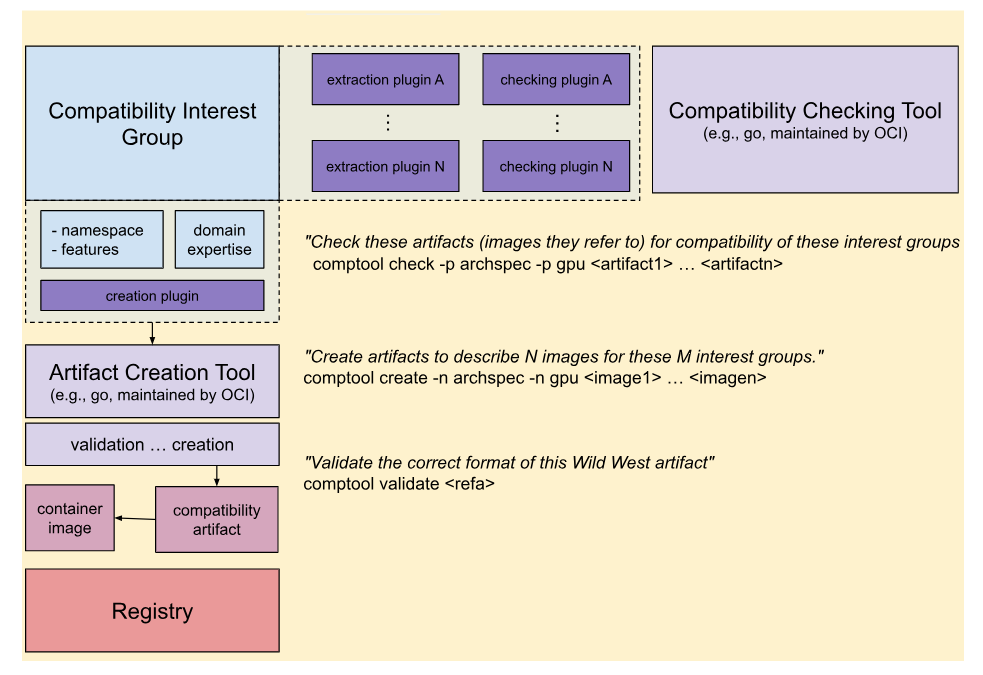

# Proposal C - Namespaced Compatibility Metadata Maintained by Compatibility Communities

This proposal introduces a new image compatibility JSON object that can be provided via an artifact type or within an existing manifest or list, with a simple structure that can be used by compatibility interest groups. Based on tools developed by these interest groups and runtime groups, cluster administrations can use artifacts to validate compatibility of an image with the host.

## Definitions

- A **Compatibility Interest Group** (CIG) has a vested interest in defining compatibility
  - Defines namespace for their community metadata defined in artifacts
  - Develops compatibility checking tools
- A **Compatibility Specification** is a pairing of metadata and method to assess goodness of fit
  - Maintained by a compatibility interest group
  - Method needs to return a boolean outcome "yes" or "no"
  - Metadata needs to be namespaced to a prefix owned by a CIG.
- A **Namespace** is a named identifies that provides an organization under which users can specify compatibility objects.
  - Owned and registered to a specific CIG
- A **Compatibility Plugin** conforms to an interface, and is developed by compatibility interest groups to run easily on the host, either integrated into a runtime (or similar) tool, or as a standalone tool.

The new image compatibility specification includes a JSON compatibility structure with keys that are owned by compatibility interest groups, and include simple key, value pairs that can be harnassed by downstream tools for analysis of compatibility. Importantly, there is no complex graph structure in the JSON object itself, but rather, the tools can supply the graph. This gives power and freedom to the compatibility interest group developers to create tools as they see fit. Several designs are afforded:

1. **Simple checking of key/value pairs**: A community might have an algorithm that is as simple as their tool checking for particular keys, and that values match for a host of interest.
2. **Graph-based logic**: A community might warrant using advanced graph parsing to do a similar assessment. An example comes from [Archspec](https://github.com/archspec), where a single architecture (from a flat artifact or the platform, depending on what the tool chooses) can [be placed in a graph](https://github.com/archspec/archspec-json/blob/master/cpu/microarchitectures.json) and used for advanced assessment of compatibility.

The above design encourages simplicity and designation of fewer metadata pieces in the OCI objects. Any complex graph-based query or additional relationships should be represented on the level of the tools that do the compatibility checking. This ensures that changes to these methods or graphs do not require re-creating extensive numbers of artifacts.

## Modifications

This proposal is agnostic to where the JSON object is placed. There are arguably pros and cons to different approaches, and the author (vsoch) leaves it to the expertise of the compatibility working group to decide on a "best" approach.

### Image Manifest

The JSON object could go directly in the image manifest or list to not require any additional artifact query or queries. For runtime tools, this would mean (still) just one call to retrieve all needed metadata to do a check. There would be no additional calls to retrieve plugins. Any compatibility checking plugins (discussed later in this proposal) would already be vetted and installed alongside the runtime tools.

- **Pros**:
  - Does not require additional query
  - Cannot get separated from the image manifest or list
  - Compatibility interest groups can develop artifacts that point TO the image (there is no required approval / permission to develop some niche compatibility definition).
- **Cons**:
  - Updating compatibility means also updating the manifest or list
  - Compatibility interest groups need to advocate to get their metadata added (unlikely / challenging)

### Compatibility Artifact

If desired, a new **Compatibility Artifact** could be added (an OCI artifact) that stores this same JSON object as  a compatibility spec. The artifact would be, akin to other OCI artifacts, stored in a registry separate from an image manifest.

- **Pros**:
  - Empowers compatibility interest groups (even niche) to create artifacts for images
- **Cons**:
  - Can easily be separated from the original manifest / image (would require tooling to check for references)
  - Requires additional queries

### Image Manifest _and_ Compatibility Artifact

We could get the best of both worlds by taking both approaches, and allowing the compatibility artifact to live in either place:

- An **internal** compatibility specification lives alongside the manifest
- An **external** compatibility specification is provided as an external artifact

Tools are allowed to choose the degree to which they want to query to find artifact metadata. Arguably "core" or "atomic" compatibility (meaning commonly used or developed by OCI) would be found within the manifests, and "off label" or "community maintained" could be allowed to point to existing images. The OCI community could designate the groups considered core to ensure consistency between tool developers. This allows us to have our cake and eat it too - runtime tools can do one check to get core compatibility data, but we don't prevent any niche compatibility interest group (e.g., HPC niche technologies or workflow tools) from also developing compatibility objects for their tooling. In both cases, the JSON objects used are equivalent, and the design of the tools (e.g., flat vs. graph) is still up to the compatibility interest group.

## Compatibility Specification

The compatibility specification is a flattened JSON object of namespaced metadata, where each namespace is controlled or owned by a compatibility working group. There is no requirement for how the different key value pairs are used by the groups, as different groups will have different levels of complexity for queries or usage. As [mentioned previously](#definitions) two example designs are:

1. **Simple checking of key/value pairs**
2. **Graph-based logic**

And the underlying tool might be using graph-based parsing, interaction with live APIs or services to get named configurations, or other functionality provided by the compatibility checking plugins.

### Simple Example

An example JSON object with key value pairs is provided below:

```json
{
    "org.network.b": { 
        "mtu": "1350",
       "vxlan": "false",
        ...
    },
    "org.network.b": { 
        "mtu": "3000",
        "vxlan": "true",
         ...
     },
    "org.supercontainers": { 
        "hardware.cpu.optimized.mode": "generic",
        "hardware.cpu.optimized.version": "skylake",
         ...
    }
}
```

Note that communities can be broken into subcommunities. For example, let's say that the supercontainers organization had separation of ownership or maintainershp for hardware vs. MPI. You could easily have:

```json
{
    "org.supercontainers.hardware": { 
        "cpu.optimized.mode": "generic",
        "cpu.optimized.version": "skylake",
         ...
    },
    "org.supercontainers.mpi": { 
        "implementation": "openmpi",
        "version": "4.2.1",
         ...
    }
}
```

The flexibility is given to the communities, and likely the namespaces should be registered somehow to avoid conflict.
Also note that the namespaced key value pairs are agnostic to algorithms that use them to determine compatibility. E.g., there is no hard rule about what consistutes passing, this logic is embedded on the level of the checking plugins. It could be that a runtime tool requires a SysAdmin to pass in an MPI implementation and version to check directly with the compatibility spec, or it could be that a tool is able to parse information automatically directly from the environment, and then walk a graph to check compatibility.

### Example with Versisoning

A more nested structure might warrant versioning of namespaces, which would use semantic versioning. The design below assumes that each namespaces confirms to one version.

```json
{
    "org.network.b": { 
         "version": "1.0.0",
         "annotations": {
           "mtu": "1350",
           "vxlan": "false",        
       },
        ...
    }
}
```

It's up for debate if the compatibility specification should allow more than one version per namespace, e.g., to provide backwards compatibility for tools that have not updated their plugins to parse it. The tool can decide to check version (or not) and the action to take when an annotation is missing.  Importantly, both approaches are simple for the human reader, not adding any graph logic into the schema itself. This complexity is optionally added by tools, and providing ways to display the graphs or complex logic (e.g., printed in a terminal) is up to the plugin tools.

## Compatibility Plugins



**Compatibility plugins** are maintained by compatibility interest groups, and follow the interfaces that are dictated (and likely provided) by the OCI Compatibility working group. E.g., OCI likely will provide a Go library that exposes an interface with common function handles for tools to use. The interface can be implemented into a standalone client (likely maintained by OCI as well) and can be integrated as a library into checking tools. OCI likely will want to start with Go and then consider (only if absolutely necessary) other languages. The exact design of this interface and development should be tackled by a follow-up working group once the path is decided here. This author (vsoch) offers to be a maintainer on these projects.

### Extraction and Checking Plugins

Three types of plugin interfaces are defined:

- An **extraction plugin** knows how to retrieve information about a system or environment.
- A **creation plugin** knows how to create a compatibility artifact or JSON object for an image of interest (the artifact creation tool can use more than one at once). This assumes receiving information from extraction plugins and/or manual addition of metadata during CI builds and similar.
- A **checking plugin** has the methods or algorithms for comparing the extracted metadata (from an extraction plugin) to a compatibility artifact (from the creation plugin). This is where simple key/value checking or graph-based logic can happen. As long as the plugin provides this functionality via the common interfaces, the underlying logic is up to the designers of the plugin.

Generally speaking, any library or command line client would receive a request for a named set of plugins (owned by compatibility groups) and then expected function interfaces would be:

- **CompatibilityCheck**: (checking plugin) the main entrypoint, which would use some number of extraction plugins (depending on needed system information) to make an assessment of compatibility.
- **Extract**: (extraction plugin) would be called by name by a compatibility check, and is expected to return a predictable structure of metadata for use by the compatibility checking plugin.
- **GenerateManifest**: (creation plugin) Taking as input a namespace for a group, version, and attributes, and generating an artifact or adding metadata to an image manifest (depending on the chosen path).

The details of these plugins and function interfaces should not be a prime concern for the document here, but by a follow up group. The above are provided for examples only. For the above, the compatibility interest groups likely define the checking plugins, and the OCI working groups (with expert groups) provide the underlying plugins for extraction or manifest generation.  A compatibility interest group could also provide an extraction plugin, if appropriate.

### Example Client - comptool

In the image above, an example client "comptool" with subcommands is shown.

The artifact creation plugin takes one or more compatibility interest group creation plugins and can dump the results into one compatibility artifact. It also handles validation for correctness. A user requesting creation for an artifact will typically target one image, but can choose as many of the creation plugins as desired (e.g., "I want my artifact to be knowledgeable about architecture, GPU, etc).

The compatibility checking tool can be interacted with as a library or command line tool. It takes a request for one or more checking plugins to validate one or more container images for compatibility with a particular environment. Specifically:

- The onset of a check loads checking plugins of interest.
- Each checking plugin uses one or more extraction plugins to assess the system
- The system metadata "extraction" steps can be loaded once and shared between tools.

## Additional Discussion

Depending on the distribution path chosen, additional discussion can be added to this proposal about the following points:

- Artifact discovery: in the case of choosing an artifact, if a registry supports the referrers API it should be used for discovery. Otherwise, artifacts need to be pulled directly via a known unique resource identifier.

## References

- [Original planning document](https://docs.google.com/document/d/1nRUuW9i7NRdYXrUr8DQXLMETXwP1J9rw3TbpLTU9yho/edit)
- [Use Cases](https://docs.google.com/document/d/1ULXHY0pdiLBlGZPN2Gj54XSvAo--UXKYr4opTrWSFMs/edit)
